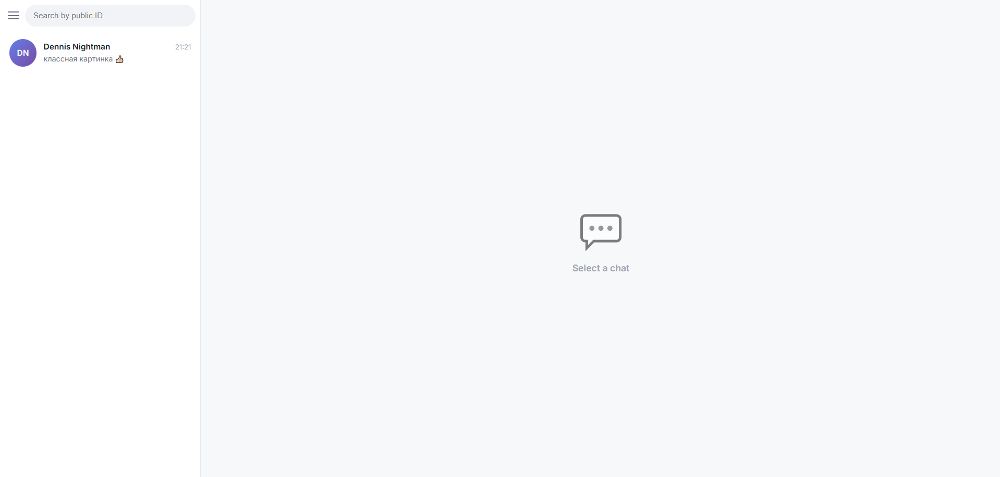
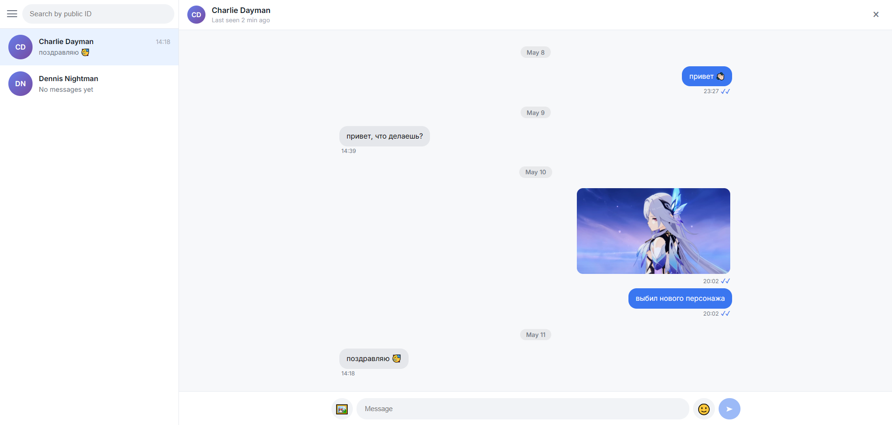
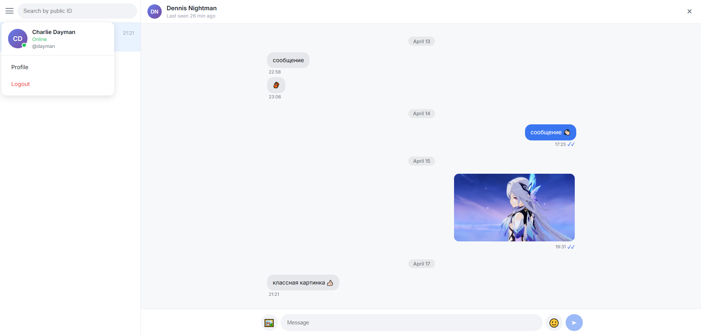
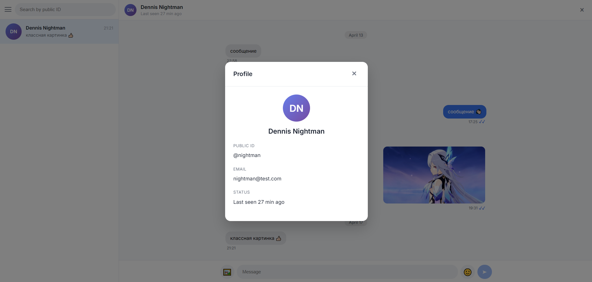
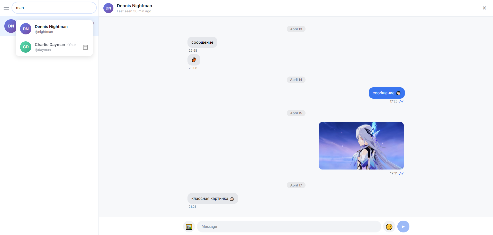
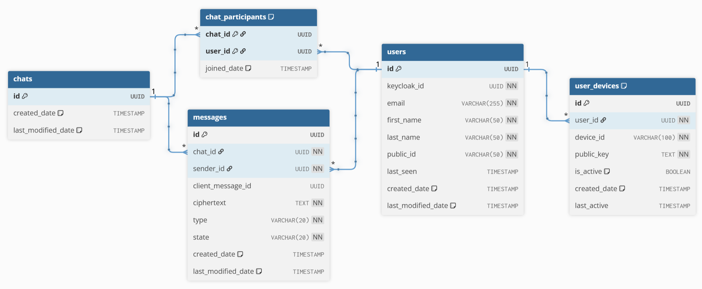

# SentStorm — Приватный мессенджер с end-to-end шифрованием

[English](./README.md) | Русский

## Обзор приложения
SentStorm — это приватный мессенджер со сквозным (end-to-end) шифрованием сообщений, при котором содержимое переписки доступно только участникам диалога и недоступно серверной стороне приложения.

---

## Основные возможности
- Регистрация и аутентификация пользователей через Keycloak;
- Поиск пользователей и создание личных чатов;
- Обмен текстовыми сообщениями и эмодзи;
- Отправка изображений без сохранения метаданных
- Доставка сообщений в реальном времени через WebSocket;
- Хранение истории переписки;
- Сквозное (end-to-end) шифрование сообщений на стороне клиента.

---

## Интерфейс приложения

### Главный экран (список чатов)
<div style="text-align: center;">
  
</div>

### Окно чата
<div style="text-align: center;">
  
</div>

### Меню пользователя
<div style="text-align: center;">
  
</div>

### Профиль пользователя
<div style="text-align: center;">
  
</div>

### Профиль собеседника
<div style="text-align: center;">
  
</div>

### Меню поиска
<div style="text-align: center;">
  
</div>

---

## Архитектура системы

```
             ┌────────────────┐                       ┌────────────────┐
             │  Пользователь  │                       │  Пользователь  │
             └───────┬────────┘                       └───────┬────────┘
                     │                                        │
                     └──────────────────┬─────────────────────┘
                                        │
                              ┌───────────────────┐
                              │   Vue.js Client   │
                              │  (Web SPA + E2EE) │
                              └─────────┬─────────┘
                                        │
                  ┌─────────────────────┼─────────────────────┐
                  │                     │                     │
             HTTPS (REST)        WSS (WebSocket)         OAuth2/OIDC
                  │                     │                     │
                  ▼                     ▼                     ▼
          ┌─────────────────────────────────────────────────────────────┐
          │                   Spring Boot Backend                       │
          │                                                             │
          │  ┌────────────────────────────────────────────────────────┐ │
          │  │                  Application Layer                     │ │
          │  │  ┌──────────┐ ┌──────────┐ ┌──────────┐ ┌──────────┐   │ │
          │  │  │   User   │ │   Chat   │ │ Message  │ │  Device  │   │ │
          │  │  │ Service  │ │ Service  │ │ Service  │ │ Service  │   │ │
          │  │  └──────────┘ └──────────┘ └──────────┘ └──────────┘   │ │
          │  │                                                        │ │
          │  │              ┌──────────────────────┐                  │ │
          │  │              │  MessagePublisher    │                  │ │
          │  │              └──────────────────────┘                  │ │
          │  └────────────────────────────────────────────────────────┘ │
          │                                                             │
          │              OAuth2 Resource Server                         │
          │              (Keycloak JWT validation)                      │
          └───────────────────────────────┬─────────────────────────────┘
                                          │
                                          ▼
                       ┌────────────────┐   ┌────────────────┐
                       │   PostgreSQL   │   │    Keycloak    │
                       │ (DB container) │   │ (Auth Server)  │
                       └────────────────┘   └────────────────┘

```

---

## Технологический стек

### Backend
- **Java 21**: Наиболее стабильная LTS-версия Java;
- **Spring Boot 4**: Основной фреймворк серверной части, упрощающий разработку REST- и WebSocket-приложений;
- **Spring Web**: Реализация REST API для взаимодействия клиента и сервера;
- **Spring WebSocket (STOMP)**: Доставка сообщений и событий в реальном времени;
- **Spring Data JPA**: ORM-слой для работы с базой данных и управления сущностями;
- **Spring Security + OAuth2 Resource Server**: Проверка JWT-токенов Keycloak и защита API;
- **PostgreSQL**: Реляционная база данных для хранения пользователей, чатов и зашифрованных сообщений;
- **Flyway**: Версионирование и миграции схемы базы данных;
- **Lombok**: Уменьшение шаблонного кода за счёт автоматической генерации геттеров, сеттеров и конструкторов.

### Frontend
- **Vue.js**: Фреймворк для создания одностраничного веб-клиента мессенджера;
- **TypeScript**: Типизированный язык разработки клиентской логики;
- **TweetNaCl**: Криптографические операции на клиенте (генерация ключей, E2E-шифрование);
- **WebSocket (STOMP)**: Получение сообщений и событий в реальном времени.

### Аутентификация
- **Keycloak**: Сервер идентификации и управления пользователями;
- **OAuth2 / OpenID Connect**: Протоколы аутентификации и авторизации;
- **JWT**: Токены доступа, используемые клиентом при обращении к API и WebSocket.

### Инфраструктура
- **Gradle**: Система сборки и управления зависимостями проекта;
- **Docker**: Контейнеризация компонентов системы (сервер, БД, Keycloak);
- **Docker Compose**: Оркестрация и совместный запуск всех сервисов среды разработки;
- **PostgreSQL (containerized)**: Развёртывание базы данных в изолированном контейнере;
- **Keycloak (containerized)**: Развёртывание сервера аутентификации в контейнере.

---
## Модель данных

### Модель сущность-связь
<div style="text-align: center;">
  
</div>

### Основные сущности проекта

#### Chat
```java
public class Chat {
   private UUID id;
   private List<Message> messages;
   private List<ChatParticipant> participants;
}
```

#### ChatParticipant
```java
public class ChatParticipant {
   private ChatParticipantId id;
   private Chat chat;
   private User user;
   private Instant joinedDate;
}
```

#### Message
```java
public class Message {
   private UUID id;
   private UUID clientMessageId;
   private Chat chat;
   private User sender;
   private String ciphertext;
   private MessageType type;
   private MessageState state;
}
```

#### User
```java
public class User {
   private UUID id;
   private UUID keycloakId;
   private String email;
   private String firstName;
   private String lastName;
   private String publicId;
   private Instant lastSeen;
   private List<UserDevice> devices;
}
```

#### UserDevice
```java
public class UserDevice {
   private UUID id;
   private User user;
   private String deviceId;
   private String publicKey;
   private Instant createdDate;
   private Instant lastActive;
   private Boolean isActive;
}
```

---

## API Эндпоинты

### Users
```
GET /users/me                   # Получить профиль текущего авторизованного пользователя
GET /users/{publicId}           # Получить публичную информацию о пользователе
GET /users/search               # Поиск пользователей по publicId для начала нового диалога
GET /users/{publicId}/devices   # Получить список устройств пользователя и их публичные ключи для E2E шифрования
```

### Chats
```
GET    /chats                 # Получить список чатов текущего пользователя
POST   /chats                 # Создать новый личный чат с пользователем
GET    /chats/{chatId}        # Получить информацию о конкретном чате
DELETE /chats/{chatId}        # Удаление чата
```

### Messages
```
POST   /messages                          # Отправить зашифрованное сообщение в чат
GET    /chats/{chatId}/messages           # Получить историю сообщений выбранного чата
PATCH  /messages/{messageId}/read         # Отметить сообщение как прочитанное (две синие галочки)
PATCH  /messages/{messageId}/delivered    # Отметить сообщение как доставленное (две серые галочки)
DELETE /messages/{messageId}              # Удаление сообщения
```

### Attachment
```
POST /messages/upload      # Загрузить изображение для отправки в сообщении
```

### Device
```
POST   /devices              # Зарегистрировать устройство пользователя и его публичный ключ
DELETE /devices/{deviceId}   # Удалить устройство пользователя из системы
```

---

## Модель безопасности

### Аутентификация
Аутентификация пользователей выполняется через Keycloak.
Все защищённые эндпоинты требуют JWT-токен в заголовке:
```
Authorization: Bearer <token>
```

Токен используется для:
- идентификации пользователя;
- проверки доступа к API;
- синхронизации пользователя между Keycloak и базой данных приложения.

### E2E шифрование
В SentStorm реализовано сквозное (end-to-end) шифрование.

Ключевые принципы:

- криптографические ключи генерируются на клиенте;
- приватные ключи никогда не передаются на сервер;
- сообщения шифруются на устройстве отправителя;
- расшифровка происходит только на устройстве получателя;
- сервер хранит только зашифрованные данные.

Сервер не имеет технической возможности прочитать содержимое переписки пользователей.

Передача данных между клиентом и сервером дополнительно защищена TLS.

---

## Сборка и запуск

### Запуск серверной части

- Запуск всех контейнеров (БД + приложение)
```
docker-compose up -d postgres
```
- Сборка проекта
```
./gradlew clean build
```
- Запуск приложения
```
./gradlew bootRun
```

### Запуск клиента
- Установка зависимостей
```
npm install
```
- Сборка проекта
```
npm run build
```
- Предпросмотр собранного проекта
```
npm run preview
```

### Порты по умолчанию

| Service | URL |
|---------|-----|
| Frontend (Vue.js) | `http://localhost:4200` |
| Backend (Spring Boot) | `https://localhost:8443` |
| Keycloak | `http://localhost:9090` |
| PostgreSQL | `localhost:5432` |

---

## Потоки взаимодействия

### Отправка сообщения
1. Клиент получает публичный ключ получателя;
2. Сообщение шифруется на клиенте;
3. Зашифрованное сообщение отправляется на сервер через REST;
4. Сервер сохраняет ciphertext в базе данных (SENT);
5. Сервер доставляет сообщение получателю;
6. При успешной доставке сервер обновляет статус сообщения (DELIVERED);
7. Клиент получателя расшифровывает сообщение локально.

### Получение сообщения
1. Если пользователь онлайн, сообщение поступает через WebSocket в режиме реального времени;
2. Если пользователь был офлайн, клиент запрашивает сообщения после подключения;
3. Сервер возвращает зашифрованные данные;
4. Клиент расшифровывает их локально;
5. При открытии чата клиент отправляет подтверждение прочтения, сервер обновляет статус сообщения (READ).

---

## Лицензия
Проект распространяется под лицензией Apache License 2.0.

Полный текст лицензии доступен в файле [LICENSE](LICENSE)
или по ссылке: http://www.apache.org/licenses/LICENSE-2.0