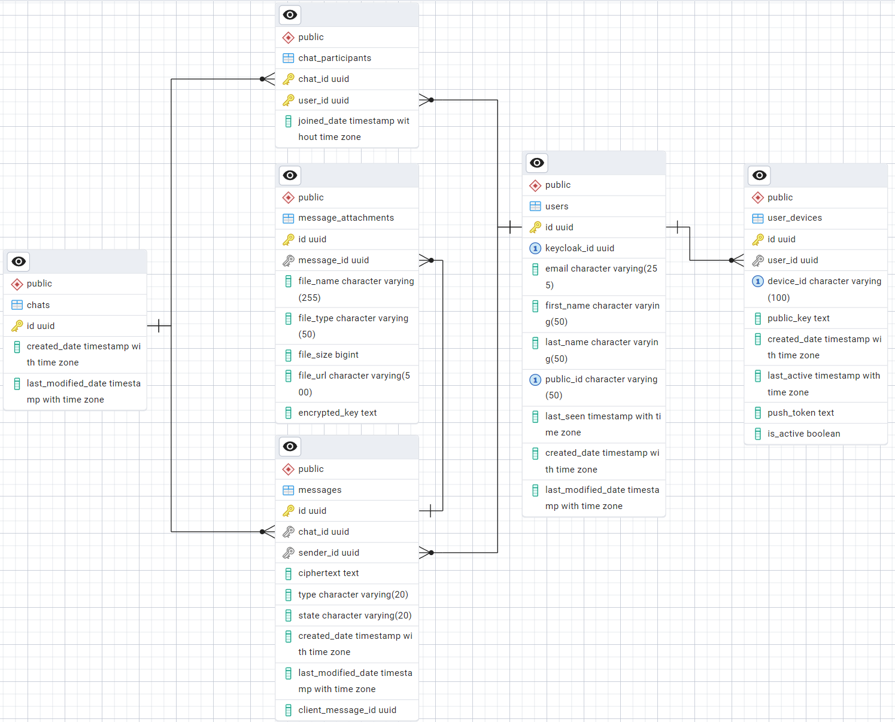

# SentStorm — Приватный мессенджер с end-to-end шифрованием

## Обзор приложения
SentStorm — это приватный веб-мессенджер для безопасного обмена сообщениями в реальном времени, разрабатываемый в рамках дипломной работы. Система реализует сквозное (end-to-end) шифрование сообщений, при котором содержимое переписки доступно только участникам диалога и недоступно серверной стороне.

Приложение построено по клиент-серверной архитектуре и состоит из веб-клиента на Angular и серверной части на Spring Boot. Сервер отвечает за аутентификацию пользователей, хранение зашифрованных данных и доставку сообщений, не имея доступа к их открытому содержимому.

---

## Основные возможности
- Регистрация и аутентификация пользователей через Keycloak;
- Поиск пользователей и создание личных диалогов;
- Обмен текстовыми сообщениями и эмодзи;
- Отправка файлов и изображений;
- Доставка сообщений в реальном времени через WebSocket;
- Push-уведомления для оффлайн-пользователей;
- Хранение истории переписки;
- Сквозное (end-to-end) шифрование сообщений на стороне клиента.

---

## Архитектура системы
SentStorm использует монолитную серверную архитектуру с разделением ответственности между клиентом и сервером.


```
             ┌────────────────┐                       ┌────────────────┐
             │  Пользователь  │                       │  Пользователь  │
             └───────┬────────┘                       └───────┬────────┘
                     │                                        │
                     └──────────────────┬─────────────────────┘
                                        │
                              ┌───────────────────┐
                              │   Angular Client  │
                              │  (Web SPA + E2E)  │
                              └─────────┬─────────┘
                                        │
              ┌─────────────────────────┼─────────────────────────┐
              │                         │                         │
          HTTPS (REST)           WSS (WebSocket)            Web Push API
              │                         │                         │
              ▼                         ▼                         ▼
        ┌────────────────────────────────────────────────────────────────┐
        │                     Spring Boot Backend                        │
        │                                                                │
        │  ┌──────────────────────────────────────────────────────────┐  │
        │  │                    Application Layer                     │  │
        │  │                                                          │  │
        │  │  UserService                                             │  │
        │  │  ChatService                                             │  │
        │  │  MessageService                                          │  │
        │  │  DeviceService                                           │  │
        │  │  FileService                                             │  │
        │  │                                                          │  │
        │  │  NotificationService                                     │  │
        │  │      ├─ WebSocketNotificationService                     │  │
        │  │      └─ PushNotificationService (FCM/Web Push)           │  │
        │  └──────────────────────────────────────────────────────────┘  │
        │                                                                │
        │  OAuth2 Resource Server (Keycloak JWT validation)              │
        └───────────────────────────────┬────────────────────────────────┘
                                        │
                                        ▼
                                ┌────────────────┐
                                │   PostgreSQL   │
                                └────────────────┘
```

---

## Технологический стек

### Backend
- **Java 21**: Наиболее стабильная LTS-версия Java;
- **Spring Boot 4**: Основной фреймворк серверной части, упрощающий разработку REST- и WebSocket-приложений;
- **Spring Web**: Реализация REST API для взаимодействия клиента и сервера;
- **Spring WebSocket (STOMP)**: Доставка сообщений и событий в реальном времени;
- **Spring Data JPA**: ORM-слой для работы с базой данных и управления сущностями;
- **Spring Security + OAuth2 Resource Server**: Проверка JWT-токенов Keycloak и защита API;
- **PostgreSQL**: Реляционная база данных для хранения пользователей, чатов и зашифрованных сообщений;
- **Flyway**: Версионирование и миграции схемы базы данных;
- **Lombok**: Уменьшение шаблонного кода за счёт автоматической генерации геттеров, сеттеров и конструкторов.

### Frontend
- **Angular**: Фреймворк для создания одностраничного веб-клиента мессенджера;
- **TypeScript**: Типизированный язык разработки клиентской логики;
- **WebCrypto API**: Криптографические операции на клиенте (генерация ключей, E2E-шифрование);
- **WebSocket (STOMP)**: Получение сообщений и событий в реальном времени.

### Аутентификация
- **Keycloak**: Сервер идентификации и управления пользователями;
- **OAuth2 / OpenID Connect**: Протоколы аутентификации и авторизации;
- **JWT**: Токены доступа, используемые клиентом при обращении к API и WebSocket.

### Инфраструктура
- **Gradle**: Система сборки и управления зависимостями проекта;
- **Docker**: Контейнеризация компонентов системы (сервер, БД, Keycloak);
- **Docker Compose**: Оркестрация и совместный запуск всех сервисов среды разработки;
- **PostgreSQL (containerized)**: Развёртывание базы данных в изолированном контейнере;
- **Keycloak (containerized)**: Развёртывание сервера аутентификации в контейнере.

---
## Модель данных

### ERD-диаграмма базы данных
<div style="text-align: center;">
  
</div>

### Основные сущности проекта

#### Chat
```java
public class Chat {
   private UUID id;
   private List<Message> messages;
   private List<ChatParticipant> participants;
}
```

#### ChatParticipant
```java
public class ChatParticipant {
   private ChatParticipantId id;
   private Chat chat;
   private User user;
   private Instant joinedDate;
}
```

#### Message
```java
public class Message {
   private UUID id;
   private UUID clientMessageId;
   private Chat chat;
   private User sender;
   private String ciphertext;
   private MessageType type;
   private MessageState state;
   private List<MessageAttachment> attachments;
}
```

#### MessageAttachment
```java
public class MessageAttachment {
   private UUID id;
   private Message message;
   private String fileName;
   private String fileType;
   private Long fileSize;
   private String fileUrl;
   private String encryptedKey;
}
```

#### User
```java
public class User {
   private UUID id;
   private UUID keycloakId;
   private String email;
   private String firstName;
   private String lastName;
   private String publicId;
   private Instant lastSeen;
   private List<UserDevice> devices;
}
```

#### UserDevice
```java
public class UserDevice {
   private UUID id;
   private User user;
   private String deviceId;
   private String publicKey;
   private Instant createdDate;
   private Instant lastActive;
   private String pushToken;
   private Boolean isActive;
}
```

---

## API Эндпоинты

### Users
```
GET /users/me              # Получить профиль текущего авторизованного пользователя
GET /users/{publicId}      # Получить публичную информацию о пользователе
GET /users/search          # Поиск пользователей по publicId для начала нового диалога
```

### Chats
```
GET    /chats                 # Получить список чатов текущего пользователя
POST   /chats                 # Создать новый личный чат с пользователем
GET    /chats/{chatId}        # Получить информацию о конкретном чате
DELETE /chats/{chatId}        # Удаление чата
```

### Messages
```
POST   /messages                          # Отправить зашифрованное сообщение в чат
GET    /chats/{chatId}/messages            # Получить историю сообщений выбранного чата
PATCH  /messages/{messageId}/read         # Отметить сообщение как прочитанное (две синие галочки)
PATCH  /messages/{messageId}/delivered    # Отметить сообщение как доставленное (две серые галочки)
DELETE /messages/{messageId}              # Удаление сообщения
```

### Attachment
```
POST /messages/upload      # Загрузить файл или изображение для отправки в сообщении
```

### Device
```
POST   /devices              # Зарегистрировать устройство пользователя и его публичный ключ
PUT    /devices/push-token   # Обновить push-токен устройства для получения уведомлений
DELETE /devices/{deviceId}   # Удалить устройство пользователя из системы
```

### Crypto
```
GET /users/{publicId}/devices   # Получить список устройств пользователя и их публичные ключи для E2E шифрования
```

---

## Модель безопасности

### Аутентификация
Аутентификация пользователей выполняется через Keycloak.
Все защищённые эндпоинты требуют JWT-токен в заголовке:
```
Authorization: Bearer <token>
```

Токен используется для:
- идентификации пользователя;
- проверки доступа к API;
- синхронизации пользователя между Keycloak и базой данных приложения.

### E2E шифрование
В SentStorm реализовано сквозное (end-to-end) шифрование.

Ключевые принципы:

- криптографические ключи генерируются на клиенте;
- приватные ключи никогда не передаются на сервер;
- сообщения шифруются на устройстве отправителя;
- расшифровка происходит только на устройстве получателя;
- сервер хранит только зашифрованные данные.

Сервер не имеет технической возможности прочитать содержимое переписки пользователей.

Передача данных между клиентом и сервером дополнительно защищена TLS.

---

## Потоки взаимодействия

### Отправка сообщения
1. Клиент получает публичный ключ получателя;
2. Сообщение шифруется на клиенте;
3. Зашифрованное сообщение отправляется на сервер через REST;
4. Сервер сохраняет ciphertext в базе данных (статус: SENT);
5. Сервер пытается доставить сообщение получателю:
    - если пользователь онлайн — через WebSocket;
    - если оффлайн — через Push-уведомление.
6. При успешной доставке сервер обновляет статус сообщения (DELIVERED;
7. Клиент получателя расшифровывает сообщение локально.

### Получение сообщения
1. Если пользователь онлайн, сообщение поступает через WebSocket в режиме реального времени;
2. Если пользователь был оффлайн, клиент запрашивает сообщения после подключения;
3. Сервер возвращает зашифрованные данные;
4. Клиент расшифровывает их локально;
5. При открытии чата клиент отправляет подтверждение прочтения, сервер обновляет статус сообщения (READ).

---

## Лицензия
Проект распространяется под лицензией Apache License 2.0.

Полный текст лицензии доступен в файле [LICENSE](LICENSE)
или по ссылке: http://www.apache.org/licenses/LICENSE-2.0